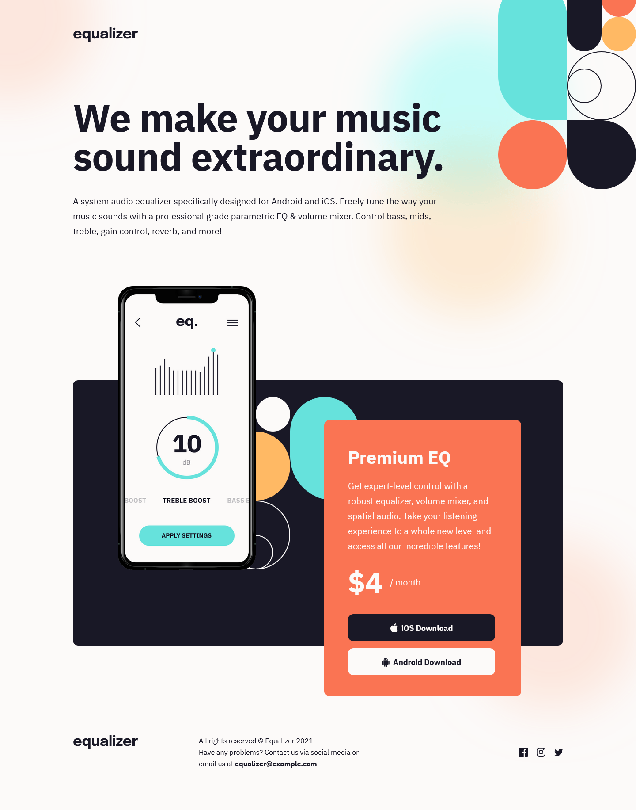

# Frontend Mentor - Equalizer landing page solution

This is a solution to the [Equalizer landing page challenge on Frontend Mentor](https://www.frontendmentor.io/challenges/equalizer-landing-page-7VJ4gp3DE).

## Table of contents

- [Frontend Mentor - Equalizer landing page solution](#frontend-mentor---equalizer-landing-page-solution)
  - [Table of contents](#table-of-contents)
  - [Overview](#overview)
    - [The challenge](#the-challenge)
  - [My process](#my-process)
    - [Built with](#built-with)
  - [Author](#author)

## Overview

### The challenge

Users should be able to:

- View the optimal layout depending on their device's screen size
- See hover states for interactive elements

### Screenshot

### Links

- Solution URL: [Mobile-first solution using CSS Custom Properties](https://www.frontendmentor.io/solutions/mobilefirst-solution-using-css-custom-properties-ZgXVSe6P6c)
- Live Site URL: [Frontend Mentor | Equalizer landing page](https://azganoth.github.io/equalizer-landing-page/)

## My process

### Built with

- HTML5
  - Semantic markup
- CSS3
  - Custom properties
  - Flexbox
  - Grid
- Mobile-first workflow

## Author

- Website - [Ademir José Ferreira Júnior](https://github.com/Azganoth)
- Frontend Mentor - [@Azganoth](https://www.frontendmentor.io/profile/Azganoth)
